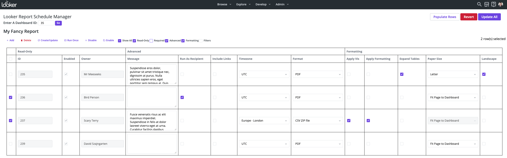

# ⚡ Admin Power Pack ⚡

The Admin Power Pack is a tool for Looker administrators to accomplish certain management tasks more efficiently. It is a Looker add-on application, built using the Looker extension framework. Currently it offers utilities for extended functionality in two main areas: **schedules** and **users**. Key features include:

- Bulk management of user accounts (select multiple users at once)
- Bulk management of dashboard schedules (see all scheduled plans in one table)
- Execute actions that aren't available in the standard UI (eg manage user credential objects)

### Schedules:

The Schedules++ Page enables admins to execute the following operations in bulk: create / update / delete (CRUD), enable / disable, resend schedules (send tests), modify filter values, modify cron / datagroups, change ownership, and prepopulate schedules.

These tasks are often time consuming for Looker admins to execute using the base UI since it requires them to sudo as each user individually. This utility allows admins to modify all schedules on a given Dashboard from a single point.

### Users:

The Users++ Page offers greater flexibility in filtering and bulk selecting user accounts, e.g. show users without email credentials or show users with duplicate names. Users can also be bulk selected based on a provided list of ids or email addresses. Once users have been selected there are actions not available in the base UI, such as create email credentials and delete SSO credentials.

There is also a feature to bulk update user email addresses according to a list of mappings. This is very handy for companies that want to change email domains or SSO providers, and want to make sure that users keep their existing Looker account after the migration.

# Usage

## Schedules++



### Features

- The entire table is editable (with exception to the read-only fields). Multiple rows can be edited at the same time. The “Revert” button will undo all local changes. Use the checkbox to the left to apply functions on specific rows:
  - **Create/Update** - Update an existing scheduled plan with row data, or create a new scheduled plan if it does not already exist. Common uses would be to change schedule ownership, modify filter values, update recipients
  - **Delete** - Delete the scheduled plan
  - **Run Once** - Reruns the schedule using the [scheduled_plan_run_once](https://docs.looker.com/reference/api-and-integration/api-reference/v4.0/scheduled-plan#run_scheduled_plan_once) endpoint. This is useful for testing specific schedules or if multiple schedules need to be resent immediately.
  - **Disable** - Disable the schedule and prevent the schedule from sending until it’s re-enabled
  - **Enable** - Enables the schedule. Re-enabling a schedule will send (maximum 1) schedule immediately, if, while it was disabled it should have run
- **Populate Rows** - This will generate a new schedule plan for each row in the results of a Looker query. The use case would be to create distinct schedules for non-Looker users where User Attributes can not be applied.
  - **Note**: Filter values will be populated if the field label matches the filter name on the Dashboard. Ensure there is a field "Email" to populate Recipients.
- View the schedule history in System Activity for each plan by clicking on the ID.

### Limitations

Only schedules sent to email destinations for User Defined Dashboards (UDDs) will load in the table. This extension **does not** currently support:

- LookML Dashboards / Looks
- Schedules sent to Webhooks / Actions / S3 / etc.
- [Conditional Alerts](https://docs.looker.com/sharing-and-publishing/alerts)
- [Embed themes](https://docs.looker.com/admin-options/settings/themes) are not supported

## Users++

### Features

### Limitations

# Installation

## Requirements

This extension requires Looker release 7.2+

- For release 7.8+, enable the “Extension Framework” labs feature in admin/labs
- For release 7.2 - 7.6, the extension_framework license flag will need to be enabled

## Steps

1. Create a new project
   - This is found under Develop => Manage LookML Projects => New LookML Project. Select "Blank Project" as your "Starting Point". You'll now have a new project with no files.
2. Create a project [manifest.lkml](https://docs.looker.com/reference/manifest-reference) file with the following application object:

```
application: admin-power-pack {
  label: "Admin Power Pack"
  url: "https://whatever.github.io/admin_power_pack/bundle.js"
}
```

3. Create a `admin_extension.model` file in your project with a [connection](https://docs.looker.com/r/lookml/types/model/connection)
   - The connection will not be used so it does not matter which connection is selected. Make sure to [configure the model you created](https://docs.looker.com/r/develop/configure-model) so that it has access.
   - **Note**: Any user who has model access to the newly created model will be able to see the Extension in the Browse dropdown menu, however:
     - The extension is only accessible to admins as it requires the ability to execute admin-level functions on behalf of other users. Non-admins will be blocked from using the extension and will see a warning message.
     - Therefore, it is recommended that only Looker admins have access to the newly created model. This may mean that the standard Roles will need to be updated to not use the “All” model set.
     - Refer to the documentation on [Setting Permissions for Looker Extensions](https://docs.looker.com/data-modeling/extension-framework/permissions) for more details on extension permissions.
4. Configure Git for the project and deploy to production
   - Create a new repository on GitHub or a similar service, and follow the instructions to [connect your project to Git](https://docs.looker.com//r/api/pull-request).
   - [Commit your changes](https://docs.looker.com/r/develop/commit-changes) and [deploy your them to production](https://docs.looker.com/r/develop/deploy-changes) through the Projects page UI.
5. Reload the page and click the Browse dropdown menu. You should see your extension in the list.

For more detailed steps, refer to steps 5 - 10 in the [Looker Extension Template Guide](https://github.com/looker-open-source/extension-template-react).

# Developing

Clone this repository.

Check that you have the node version listed in the `.node-version` file.

Run `yarn install` to install dependencies.

Run `yarn start` to start the dev server.

Follow the installation instructions, pointing the LookML project manifest to your dev server url instead.
