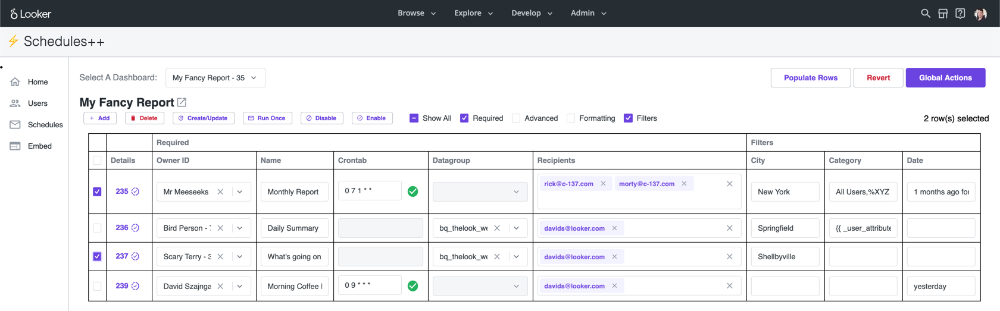
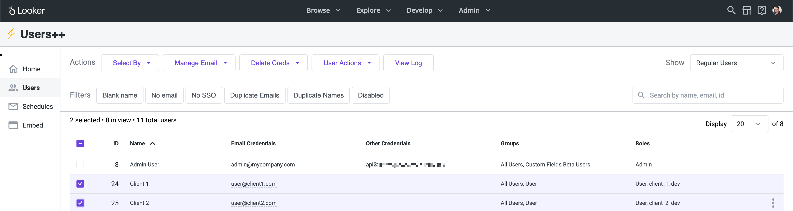

# ⚡ Admin Power Pack ⚡

The Admin Power Pack is a tool for Looker administrators to accomplish certain management tasks more efficiently. It is a Looker add-on application built using the Looker extension framework. Currently it offers utilities for extended functionality in two main areas: **schedules** and **users**. Key features include:

- Bulk management of user accounts (select multiple users at once)
- Bulk management of dashboard schedules (edit multiple scheduled plans in one table)
- Execute actions that aren't available in the standard UI (e.g. manage user credential objects)

# Usage

## Schedules++

The Schedules++ Page enables admins to execute operations in bulk to modify schedules.

### Global Actions

These actions will be applied across all schedules across the instance:

- **Find & Replace Emails** - Update email destinations from a CSV of email address mappings
- **Reassign Ownership** - Reassign ownership of all schedule plans from selected users to a new user
- **Resend Failed Schedules** - Validate and resend any schedules that have failed on their most recent attempt, within a specified timeframe
- **Select By Query** - Choose a bulk action to run (Enable, Disable, Delete, Run Once) on all schedule plans with a System Activity query ID

### Schedules Table

The Schedules++ Page enables admins to execute operations in bulk and modify all schedules on a given Dashboard from a single point, without the need to sudo as users to modify their schedule plans.

The entire table is editable. Multiple rows can be edited at the same time. The “Revert” button will undo all local changes. **Details** contains metadata on the schedule plan, with links to System Activity and viewing the Dashboard with the schedule filters. Use the checkbox to the left to apply functions on specific rows:

- **Create/Update** - Update an existing scheduled plan with table data, or create a new scheduled plan if it does not already exist. Common uses would be to change schedule ownership, modify filter values, update recipients
- **Delete** - Delete the scheduled plan
- **Run Once** - Reruns the schedule using the [scheduled_plan_run_once](https://docs.looker.com/reference/api-and-integration/api-reference/v4.0/scheduled-plan#run_scheduled_plan_once) endpoint. This is useful for testing specific schedules or if multiple schedules need to be resent immediately
- **Disable** - Disable the schedule and prevent the schedule from sending until it’s re-enabled. The `Disable` and `Enable` functions modify the scheduled plan's enabled state. This is only accessible via Looker's API
- **Enable** - Enables the schedule. Re-enabling a schedule will send (maximum 1) schedule immediately, if, while it was disabled it should have run
- **Generate Plans** - This will generate a new schedule plan for each row in the results of a Looker query. The use case would be to create distinct schedules for non-Looker users where User Attributes can not be applied.
  - Filter values will be populated if the field label matches the filter name on the Dashboard. Ensure there is a field "Email" to populate recipient destinations

### Limitations with Schedules Table

Only schedules sent to email destinations for User Defined Dashboards (UDDs) will load in the table. This extension **does not** currently support:

- LookML Dashboards / Looks
- Schedules sent to Webhooks / Actions / S3 / etc.
- [Conditional Alerts](https://docs.looker.com/sharing-and-publishing/alerts)
- [Embed themes](https://docs.looker.com/admin-options/settings/themes) are not supported

## Users++

The Users++ Page offers greater flexibility in filtering and bulk selecting user accounts, e.g. show users without email credentials or show users with duplicate names.

Users can also be bulk selected based on a provided list of ids, email addresses, or a Looker query. Once users have been selected there are actions not available in the base UI, such as create email credentials and delete SSO credentials.

The following functions are available via the _Actions_ bar:

- **Select By:**
  - **User ID or email address** - Select users by CSV of user IDs or email address
  - **Query ID** - Select users with a System Activity query ID
- **Bulk Mappings:**
  - **Bulk create from mapping** - Bulk create new users with User Attributes from a CSV mapping
  - **Bulk update from mapping** - Bulk update user email addresses according to a CSV mapping. This is very handy for companies that want to change email domains or SSO providers, and want to make sure that users keep their existing Looker account after the migration
- **Functions:**
  - **Users**
    - **Enable / Disable users** - Enable or Disable selected users
    - **Delete users** - Delete selected users
    - **Logout users** - Terminate selected users sessions
  - **User Attributes**
    - **Set / Delete user attributes** - Set and Delete User Attributes for selected users at a user level
  - **Groups**
    - **Add / Remove users to groups** - Add and Remove selected users from groups
  - **Roles**
    - **Set roles** - Set roles (overwrite) for selected users at a user level
  - **Manage Credentials**
    - **Auto-fill from other creds** - Create email credentials for selected users from the email address already assigned from other credential types
    - **Bulk send email creds** - Bulk send password reset emails to selected users. If the user has not yet set up their account, it will send a setup email to the user
    - **Bulk create password reset** - Bulk create password reset URLs for selected users. If the user has not yet set up their account, a setup URL is generated
    - **Delete Creds** - Delete one of the following credential types for the selected users: "Email", "Google", "LDAP", "OIDC", "SAML"

The _Filters_ bar allows you to trim the displayed table of users to a specific subset of users, using the select menu, button group, and search bar. **(Note that all filters are additive)**

- **Select Menu** - Quick filter menu used to only display users by type: _All Users_, _Regular Users_, _Embed Users_, _Looker Support_, or _Only Selected_. By default, the menu will display _Regular Users_ (excluding _Embed Users_ and _Looker Support_). _Only Selected_ will filter to users that have been selected
- **Button Group** - Preset filter buttons to only display users that meet the criteria: _blank name_, _no email_, _no SSO_, _duplicate emails_, _duplicate names_, _disabled_, and _not disabled_
- **Search Bar** - Search by user name, email, or id

## Common Workflows

### Bulk Creating New Users

1. Use the `Bulk create from mapping` function to upload a CSV of user emails, names, and User Attributes
1. Select the newly created users by using the `Select by email address` function
1. Use the `Add users to groups` and `Set roles for users` functions to add these new users to specific groups or roles
1. Use the `Bulk send email creds` to send the Welcome Email to these users

### Updating Email Addresses For Authentication Integration

1. Follow the steps for enabling user authentication [here](https://docs.looker.com/admin-options/security)
1. If the "Merge by Email" option is not working due to differences in the email credential (e.g. case sensitivity or a different domain), use the `Bulk update from mapping` function to update email addresses from a CSV mapping
1. Finish the authentication setup
1. Use the `Find & Replace Emails` function in the Schedules tab to bulk update the destination email addresses for all schedules

### Switching to a new Idp

1. Notify users not to log in and disable the existing IdP authentication in Admin/Authentication
1. Use the `Auto-fill Email Credentials` function to create email creds (many users may only have IdP or API based creds)
1. Use the `Bulk update from mapping` function to update email creds to new email addresses
1. `Delete Creds` from the old Idp
1. Enable new IdP authentication in Admin/Authentication
1. Notify users to log in
1. Use the `Find & Replace Emails` function in the Schedules tab to bulk update the destination email addresses for all schedules

# Installation

## Requirements

This extension requires Looker release 7.8 or later. Be sure to enable the “Extension Framework” labs feature.

**Note**: Any user who has model access to the "admin_power_pack" model (possibly via the "All" model set) will be able to see the APP in the Browse dropdown menu. However:

- Extensions always run with the permissions of the currently logged-in user and can't escalate permissions or do anything a regular user can't do. A non-Admin cannot be granted additional powers via an extension.
- The APP checks the user roles and displays a friendly message page if the user is not an Admin.

However in order to avoid confusion, it is still recommended that only Looker admins have access to the admin_power_pack model. This may mean that the standard roles will need to be changed to not use the “All” model set.

- There is no need to create new model sets or roles for the APP, since Admins can always see all models.
- Refer to the documentation on [Setting Permissions for Looker Extensions](https://docs.looker.com/data-modeling/extension-framework/permissions) for more details on extension permissions.

## Option 1 - Marketplace Install (easiest)

LookML Projects are backed by git repositories. This repo has been set up with all the other necessary LookML files in addition to the application javascript. You can install this extension via the Marketplace, however the project will be read-only so you will not be able to deploy any changes to the files.

1. Create a New Database Connection
   - This is needed purely as a stub for the new project configuration. The APP does not communicate with any of your databases. This new connection will merely be a stub that does not point to a real system
   - Navigate to Admin => Connections. Select the "Add Connection" button
   - You can pick any dialect and fill in bogus values for the required fields. We recommend selecting PostgreSQL, host= "localhost", database= "notreal", user= "notreal"
   - Uncheck the "SQL Runner Precache" and then Add Connection. Don't bother testing the connection
1. Install via Marketplace Git URL (further details [here](https://docs.looker.com/data-modeling/marketplace#installing_a_tool_from_a_git_url))
   - Navigate to Marketplace => Manage
   - Click the three-dot menu, and select "Install via Git URL". Enter the following:
     - Git Repository URL: `https://github.com/looker-open-source/admin_power_pack.git`
     - Git Commit SHA: `master`
     - _Note: For Looker instances on a release before 22.4, use the commit SHA from the previous [major release](https://github.com/looker-open-source/admin_power_pack/releases/tag/v0.1.7) of the Admin Power Pack: `35eb28417ff5de04b1d9f09e19df000087feb501`. This is due to [breaking changes](https://developers.looker.com/api/advanced-usage/version-4-ga) to the API 4.0 endpoints. For Looker instances on the 22.4+ release, use the current major release of the Admin Power Pack._
   - Accept the extension project permissions
   - Select the connection name used in Step 1 and click Install
1. To update the APP for new releases, navigate to Marketplace => Manage, and remove and re-add the tool

## Option 2 - Roll your own

The end result of this will be similar to the above, except that the git repo will be writable.

1. Create a New Project
   - This is found under Develop => Manage LookML Projects, then select the New LookML Project button in top right corner
   - Give your project a name such as "admin_power_pack"
   - As the "Starting Point" select "Blank Project". You'll now have a new project with no files
1. Create a project manifest based on this [example](manifest.lkml)
   - Use the `url` parameter to point to the [GitHub Pages hosted version](https://looker-open-source.github.io/admin_power_pack/dist/looker_admin_power_pack.js) of this extension. This version will be updated regularly
   - Alternatively, use the `file` parameter to host the application javascript in the LookML repo and include the [javascript file](dist/looker_admin_power_pack.js) in the LookML project _(See note above for instances on a release before 22.4)_
1. Create a new model file in your project named "admin_power_pack.model"
   - Provide a [connection](https://docs.looker.com/r/lookml/types/model/connection) value (see above notes on models and connections)
   - Make sure to [configure the model you created](https://docs.looker.com/r/develop/configure-model) so that it has access to the connection. Develop => Manage LookML Projects => Configure button next to the new model
1. Configure git for the project and deploy to production
   - You can use the "Create Bare Repository" option to create a repo that exists only on the Looker server. This is usually sufficient unless you have a critical need to store the code elsewhere
   - In that case, create a new repository on GitHub or a similar service, and follow the instructions to [connect your project to git](https://docs.looker.com/data-modeling/getting-started/setting-up-git-connection)
   - [Commit your changes](https://docs.looker.com/r/develop/commit-changes) and [deploy them to production](https://docs.looker.com/r/develop/deploy-changes) through the Projects page UI
   - Once deployed, you will now see "Admin Power Pack" in the Browse menu

# Developing

Clone this repository.

Check that you have the node version listed in the `.node-version` file.

Run `yarn install` to install dependencies.

Run `yarn start` to start the dev server.

Follow the installation instructions, pointing the LookML project manifest to your dev server url instead.
